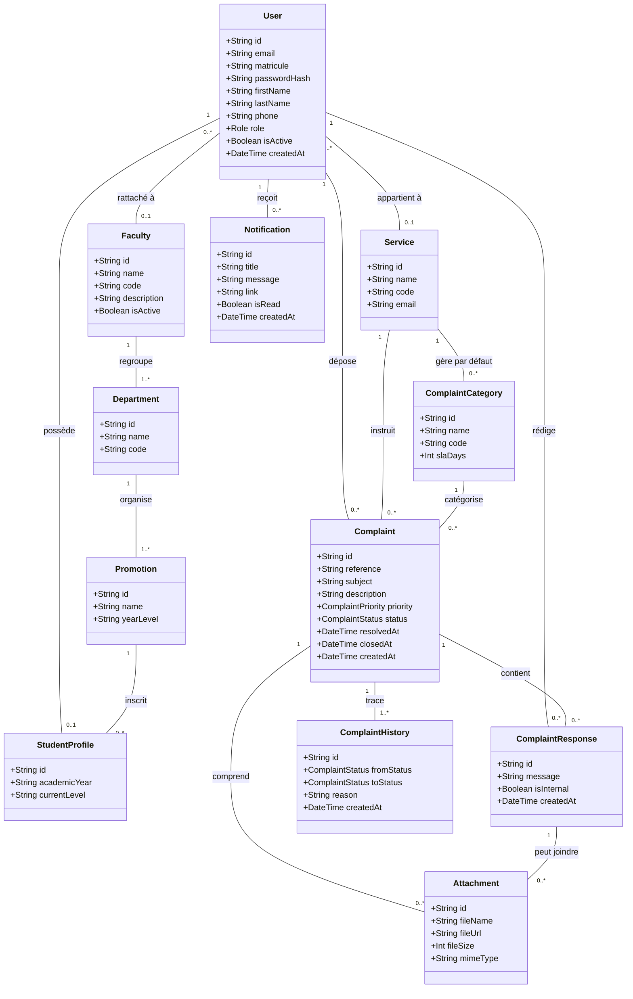
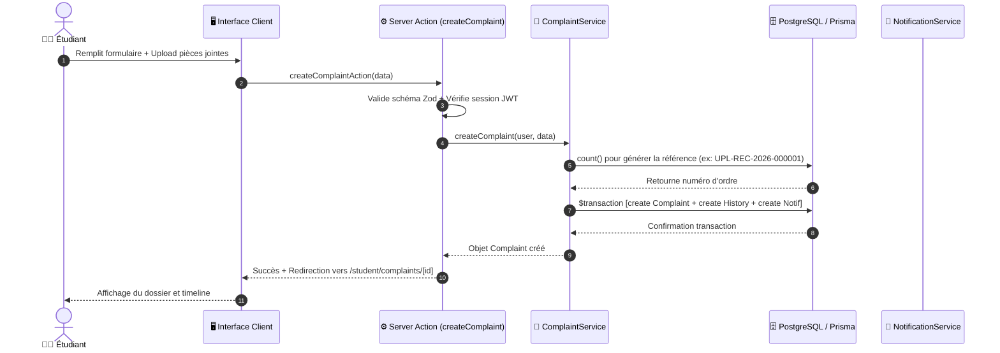
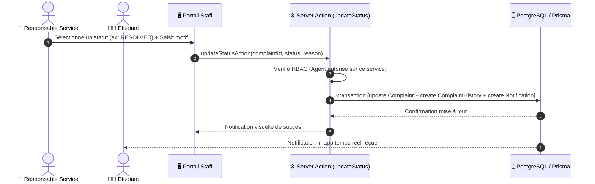
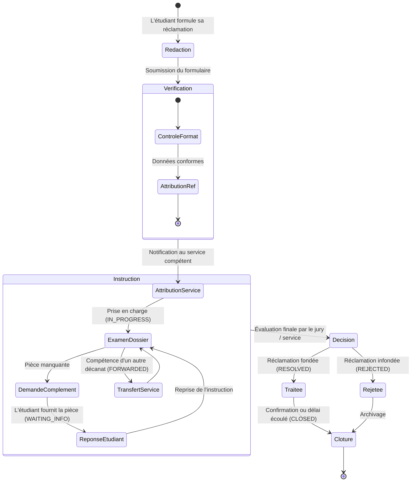

# DIAGRAMMES UML — PROJET DE FIN D'ÉTUDES
## Application Web de Gestion des Réclamations des Étudiants (UPL)

---

## 1. Diagramme de Cas d'Utilisation Global

```mermaid
flowchart TB
    subgraph Acteurs
        E["👨‍🎓 Étudiant UPL"]
        S["👔 Responsable de Service / Staff"]
        A["🛡️ Administrateur Central UPL"]
        SYS["⚙️ Système (Automate)"]
    end

    subgraph "Système UPL Réclamations"
        UC1(["S'authentifier / Gérer son profil"])
        UC2(["Déposer une réclamation avec justificatifs"])
        UC3(["Consulter le suivi de ses dossiers"])
        UC4(["Répondre et dialoguer sur un dossier"])
        UC5(["Recevoir des notifications"])
        
        UC6(["Consulter la file des dossiers du service"])
        UC7(["Mettre à jour le statut (En cours, Traitée, etc.)"])
        UC8(["Demander un complément d'information"])
        UC9(["Transférer à un autre service"])
        UC10(["Rédiger une note interne"])
        
        UC11(["Superviser toutes les réclamations"])
        UC12(["Gérer les utilisateurs et rôles"])
        UC13(["Gérer les référentiels (Facultés, Services, Catégories)"])
        UC14(["Consulter les statistiques et rapports décanaux"])
        
        UC15(["Générer la référence unique UPL-REC"])
        UC16(["Enregistrer l'historique inaltérable (Audit Trail)"])
    end

    E --> UC1
    E --> UC2
    E --> UC3
    E --> UC4
    E --> UC5

    S --> UC1
    S --> UC6
    S --> UC7
    S --> UC8
    S --> UC9
    S --> UC10
    S --> UC5

    A --> UC1
    A --> UC11
    A --> UC12
    A --> UC13
    A --> UC14

    UC2 -.->|déclenche| UC15
    UC7 -.->|déclenche| UC16
    UC8 -.->|déclenche| UC5
    UC7 -.->|déclenche| UC5
```

---

## 2. Diagramme de Classes du Domaine

---

## 3. Diagramme de Séquence : Soumission d'une Réclamation

---

## 4. Diagramme de Séquence : Instruction et Changement de Statut

---

## 5. Diagramme d'Activité : Cycle Complet du Traitement

